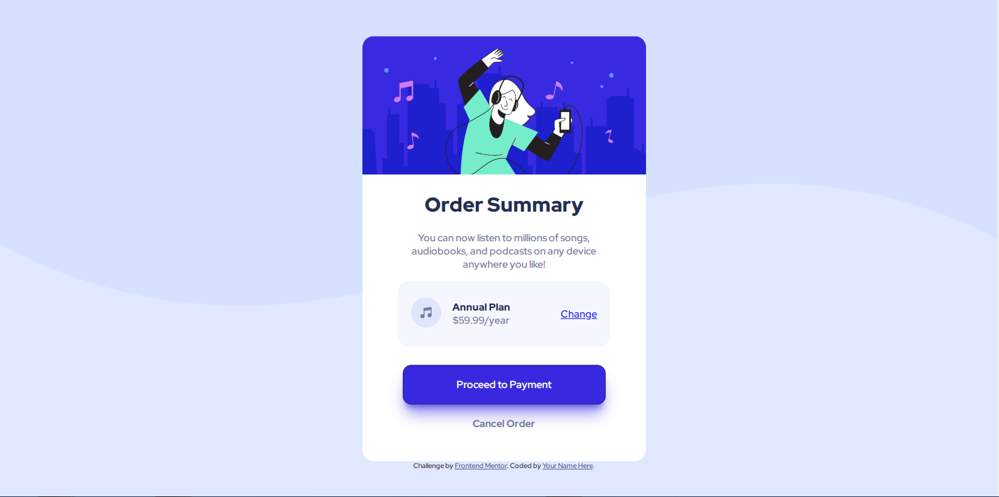

# Frontend Mentor - Order summary card solution

This is a solution to the [Order summary card challenge on Frontend Mentor](https://www.frontendmentor.io/challenges/order-summary-component-QlPmajDUj). Frontend Mentor challenges help you improve your coding skills by building realistic projects. 

## Table of contents

- [Overview](#overview)
  - [The challenge](#the-challenge)
  - [Screenshot](#screenshot)
  - [Links](#links)
- [My process](#my-process)
  - [Built with](#built-with)
  - [What I learned](#what-i-learned)
  - [Continued development](#continued-development)
  - [Useful resources](#useful-resources)
- [Author](#author)
- [Acknowledgments](#acknowledgments)

## Overview

### The challenge

Users should be able to:

- See hover states for interactive elements

### Screenshot



### Links

- Solution URL: [My solution URL](https://www.frontendmentor.io/solutions/ordersummarycomponent-A5QrzHjbf)
- Live Site URL: [My live site URL](https://order-summary-component-5z4q2gki3-arsole676.vercel.app/)
- Reposotory: [Site_Repository](https://github.com/Arsole676/order-summary-component.git)

## My process

### Built with

- Semantic HTML5 markup
- CSS/SCSS custom properties
- Flexbox


### What I learned

In this project i learned about practical UI development and usage of flexbox and box sahdows in various things.

To see how you can add code snippets, see below:

```html
<div class="flexbox">My flex box</div>
```
```scss

/* SCSS COMPILED CODE*/

.flexbox {
  display: flex;
  position: absolute;
  -webkit-box-align: center;
      -ms-flex-align: center;
          align-items: center;
  -ms-flex-line-pack: center;
      align-content: center;
  -webkit-box-pack: center;
      -ms-flex-pack: center;
          justify-content: center;
  top: 50%;
  left: 50%;
  -webkit-transform: translate(-50%, -50%);
          transform: translate(-50%, -50%);
}
```

### Continued development

I will try my best to make wonderful websites like this and use this frontendmentor as my practice I really liked the challenges that I found here.

### Useful resources

- [W3 Schools flexbox](https://www.w3schools.com/css/css3_flexbox.asp) - This helped me for place my components in the correct ideal position. I really liked this pattern and will use it going forward.

- [W3 Schools Scss tutorial](https://www.w3schools.com/sass/) - This is an amazing article which helped me finally understand scss. I'd recommend it to anyone still learning this it.

- [@Media_queries](https://www.w3schools.com/css/css_rwd_mediaqueries.asp) - This tutorial helped me to make my web app device responsive, here is the tutorial link.

- [box-shadows][https://getcssscan.com/css-box-shadow-examples] - Making box shadows can sometime become a big challeng we might sometimes become the victem of spaghetti code, this site helped me by providing ready made snippets ok existing code of css.

## Author

- Website - [Arsole676](https://www.your-site.com)
- Frontend Mentor - [@Arsole676](https://www.frontendmentor.io/profile/Arsole676)
- Gmail - [Gamil_me](https://mail.google.com/mail/u/0/?fs=1&tf=cm&source=mailto&to=arsole676@gmail.com)

## Acknowledgments

In this coding project I have learned about css, UI designing and flexbox, I thank this website from the bottom of my heart for the oppurtonities I found in the website, I wish i could have found this website earlier to sharpen my frontend skills, Thank you.

